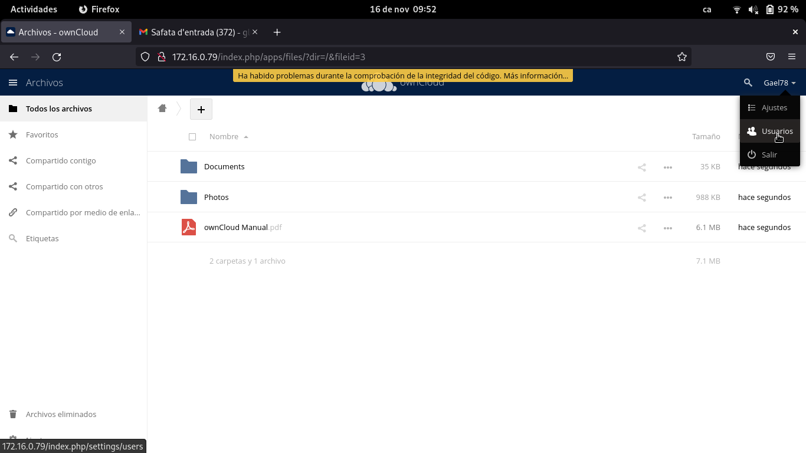
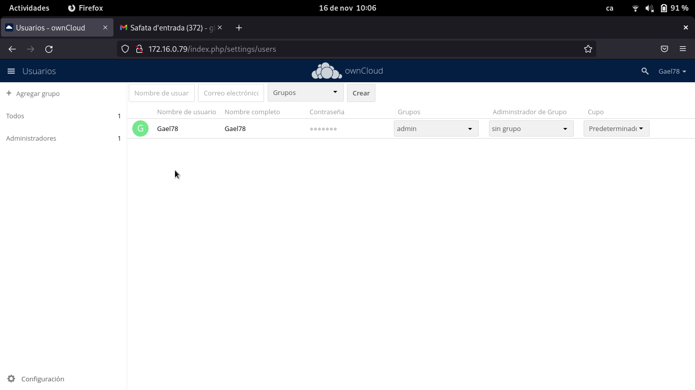
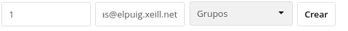
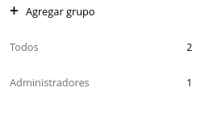
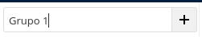
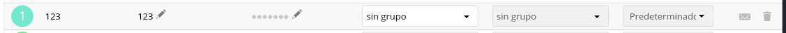
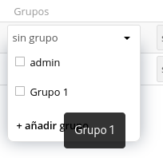
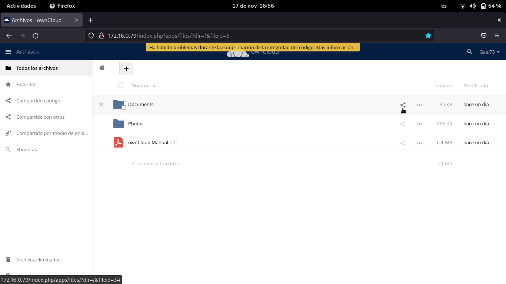
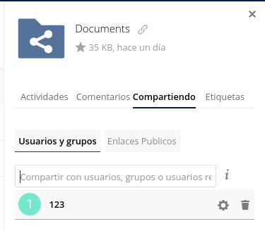

#OwnCloud

PROGRAMACION DEL OwnCloud

1. Una vez iniciado sesion, nos metemos en la opcion Usuarios.

2. Para crear un usuario debes rellenar los siguientes espacios blancos:

3. Para crear un grupo debes hacer lo siguiente:

4. Para añadir un usuario a un grupo debes hacer:

- Seleccionar el usuario que quieras introducir al grupo

- En la columna de grupo dentro de los usuarios te da opcion de elegir a que grupo pertenece.

En mi caso lo meto en el Grupo 1:

Para compartir una carpeta debes irte a la opcion de ``archivos`` seleccionas la carpeta y a la persona que quieres comparir:

