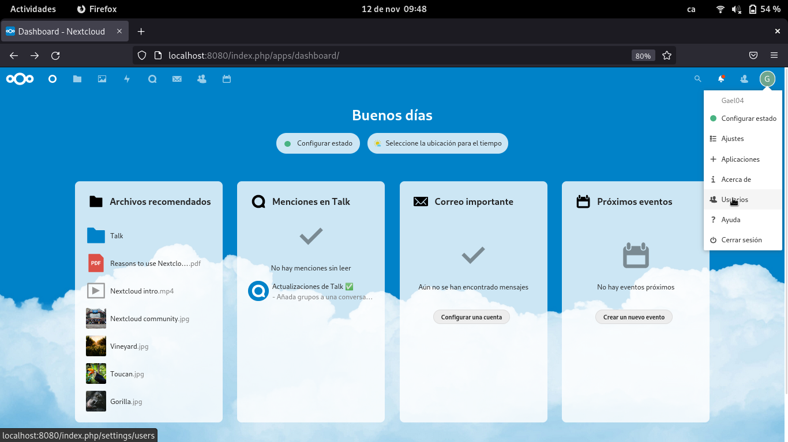
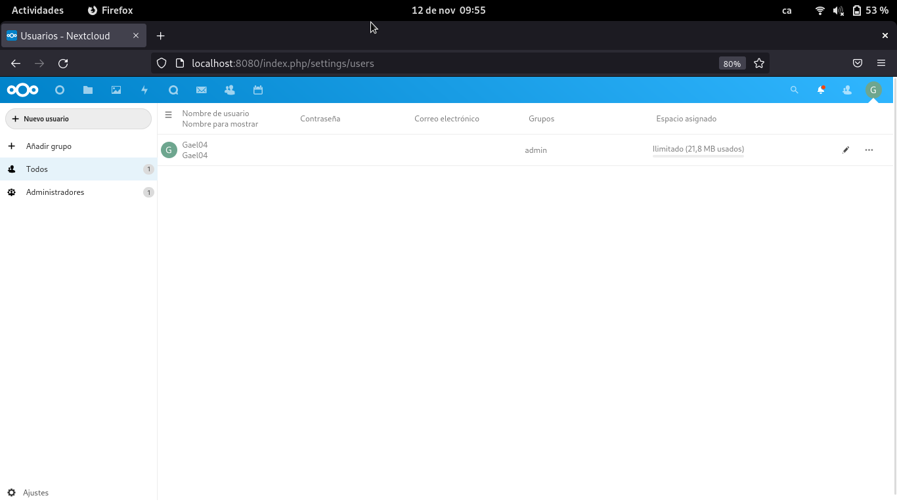
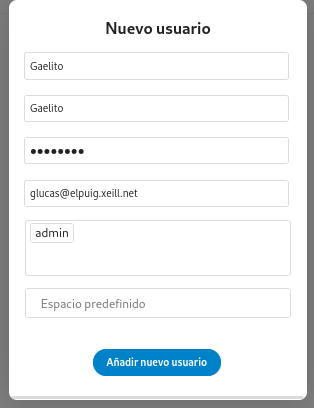
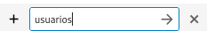
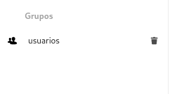
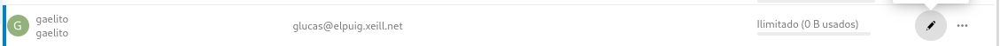
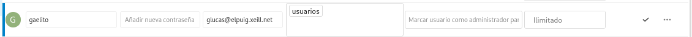
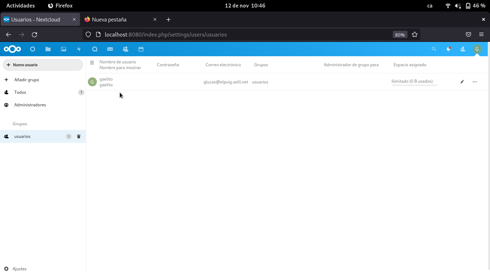
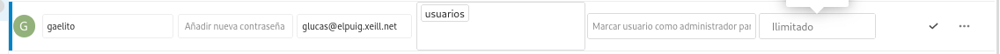
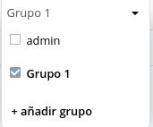

# NextCloud

PROGRAMACIÓN DE NEXTCLOUD

1. Una vez iniciado sesion, nos metemos en la opcion Usuarios.

2. En esta pestaña, le damos a ``Nuevo usuario`` y definimos los espacion en blanco.

3. Creamos un Grupo llamado Usuarios

4. Para meter al usuario que hemos creado anteriormente debes hacer:

5. Tambien se puede cambiar el espacio de trabajo.

